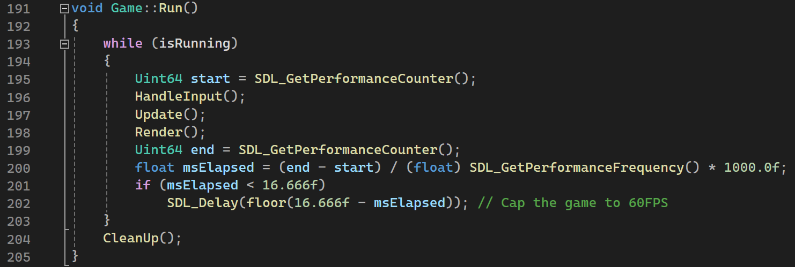

# Letrio Report
Letrio is a falling-block puzzle game about making words.

## Dependencies
- SDL2 library - https://www.libsdl.org/
- SDL2_ttf library - https://github.com/libsdl-org/SDL_ttf
- irrKlang library - https://www.ambiera.com/irrklang/downloads.html

## Third-party Assets
- KarenFat.ttf font - https://www.pentacom.jp/pentacom/bitfontmaker2/gallery/?id=346
- words_alpha.txt file - https://github.com/dwyl/english-words

## YouTube Video
YouTube Video: https://youtu.be/7idDiGCV7Hg

## Game Objective
The objective of Letrio is to use letters within given tromino pieces to make words in a grid. 

A piece will fall from the top of the grid, and when it reaches the bottom, it will fix into place, and the next piece will be generated at the top. 

The player can manipulate pieces to place letters in different positions to create words. 

When a word is created, the player's score will increase, the letters within the word will disappear from the grid, and gravity will cause any letters within the affected columns to drop.

If a piece is generated and it overlaps any existing letters on the grid, the game is over.

## Controls
- **Left/Right Arrow Keys** - Move piece left/right
- **Down Arrow Key (Hold)** - Drop piece faster
- **Up Arrow Key** - Drop piece instantly
- **Z/X** - Rotate piece anticlockwise/clockwise
- **C** - Shuffle letters in piece
- **Space** - Change piece shape
- **Return** - Pause game
- **Escape** - Quit game

## Design Diagrams

### Piece Orientation, Shape & Alignment Diagram
The following diagram shows all of the possible combinations of shapes and orientations, and their alignments:

### Class Diagram
The following diagram highlights the main classes, member variables and methods within the game:

## Game Programming Patterns

### Game Loop

### Update Method

## Game Mechanics + Example Code

### Moving Pieces
Pieces can move left and right. They can also drop faster or instantaneously.

### Rotating Pieces
Pieces can rotate clockwise or anticlockwise. The origin of rotation is the grid cell of the second/middle character.

### Shuffling Letters (Unique)
Letters within a piece can shuffle positions.

### Changing Piece Shape (Unique)
Pieces can change between an L shape and a Line shape.

### Making Words
Valid words are four or more letters in length. Words must be written from left to right, or from top to bottom.

### Gravity
When pieces are fixed to the board, gravity takes effect and drops letters as low as possible. This can create combos of making words.

### Levels
For every 5 words the player makes, the level will increase. This will cause the pieces to drop faster and increase the difficulty.

### Pause Anticheat
To prevent players from pausing to cheat and slow the game down, the screen will clear the grid while the game is paused.

### Letter Probabilities
The game uses a discrete distribution with weights for each letter of the alphabet to generate characters inside a piece. 
Vowels are weighted higher so they are more likely to generate, making it easier to create words.

## Sample Screens

### Start Screen

### Normal Gameplay

### Pause Screen

### Game Over Screen

## Exception Handling

### System/Subsystem Initialisation

### File Handling

## Test Cases
A piece can come in one of eight permutations (4 orientations \* 2 shapes) listed below:
- Up-oriented L-shape
- Up-oriented Line-shape
- Right-oriented L-shape
- Right-oriented Line-shape
- Down-oriented L-shape
- Down-oriented Line-shape
- Left-oriented L-shape
- Left-oriented Line-shape

The following tests were performed on 02/11/24:
| Case | Expected Outcome | Actual Outcome |
| --- | --- | --- |
| Check if pieces in all permutations can move left outside of grid | Pieces stay within grid boundaries | Pieces stayed within grid boundaries |
| Check if pieces in all permutations can move right outside of grid | Pieces stay within grid boundaries | Pieces stayed within grid boundaries |
| Check if pieces in all permutations can rotate clockwise to place a character outside of the grid | Pieces stay within grid boundaries | Pieces stayed within grid boundaries |
| Check if pieces in all permutations can rotate anticlockwise to place a character outside of the grid | Pieces stay within grid boundaries | Pieces stayed within grid boundaries |
| Check if pieces in all permutations can change shape to place a character outside of the grid | Pieces stay within grid boundaries | Pieces stayed within grid boundaries |
| Check if pieces in all permutations can shuffle letters to change character positions | Letters change positions | Letters changed positions |
| Check if pieces in all permutations can instant drop to bottom grid boundary | Pieces drop to bottom grid boundary | Pieces dropped to bottom grid boundary |
| Check if pieces in all permutations can instant drop on top of a character | Pieces drop on top of character in grid | Pieces dropped on top of character in grid |
| Check if currentPiece changes to nextPiece when fixing to grid | currentPiece changes to nextPiece | currentPiece changed to nextPiece |
| Check if gravity causes letters to fall when fixing to grid | Letters fall to lowest possible position | Letters fell to lowest possible position |
| Check if game over screen is shown when piece overlaps | Game over screen is shown | Game over screen was shown |
| Check if pause screen clears letters from grid | Pause screen clears letters from grid | Pause screen cleared letters from grid |

## Evaluation
I believe that I have created a fun prototype of a game that demonstrates a good understand of writing unmanaged code in the object-oriented paradigm. 

I am particularly proud of the audio feedback that the game provides, as it significantly improves the immersion of the game in my opinion. 

I also designed all of the audio myself using a program called FamiTracker. The main theme is a high-tempo cover of [Orchestral Suite No. 2 in B Minor, BWV 1067: II. Rondeau](https://youtu.be/IYEQ1-Y5zCw?si=_AXVerQ2gZat-6F5) by J.S. Bach.

If I were to continue working on this project, I would try to improve the visual feedback of the game, as many actions in the game feel too instantaneous/sudden, particularly when using gravity to create combos.